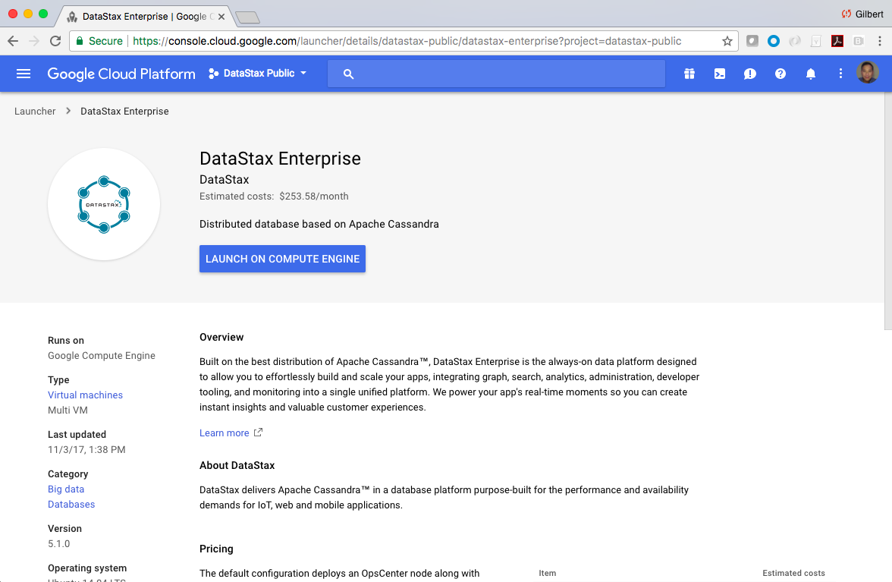
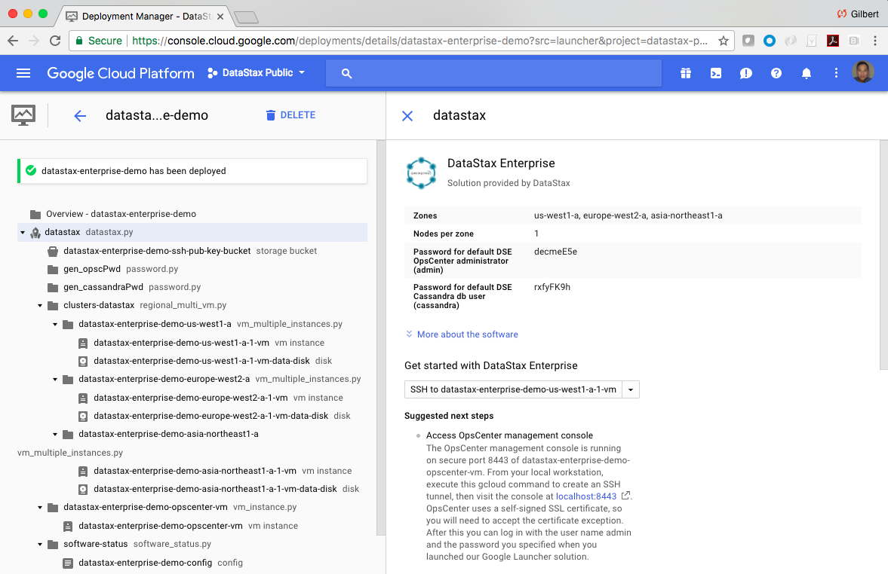
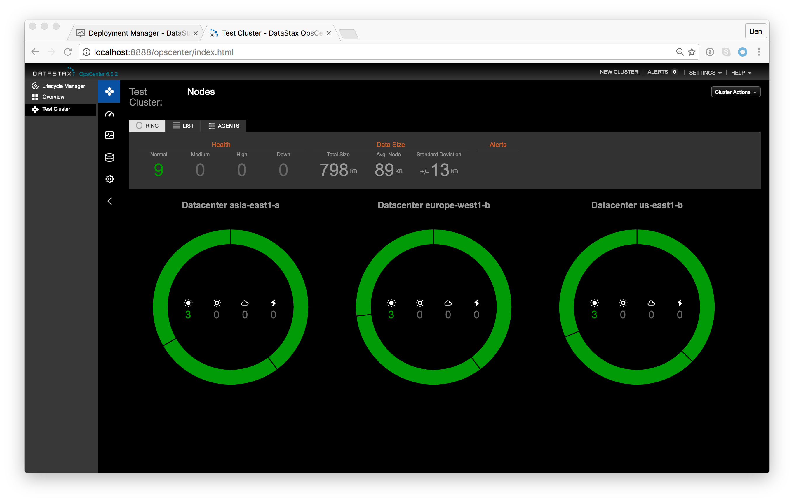
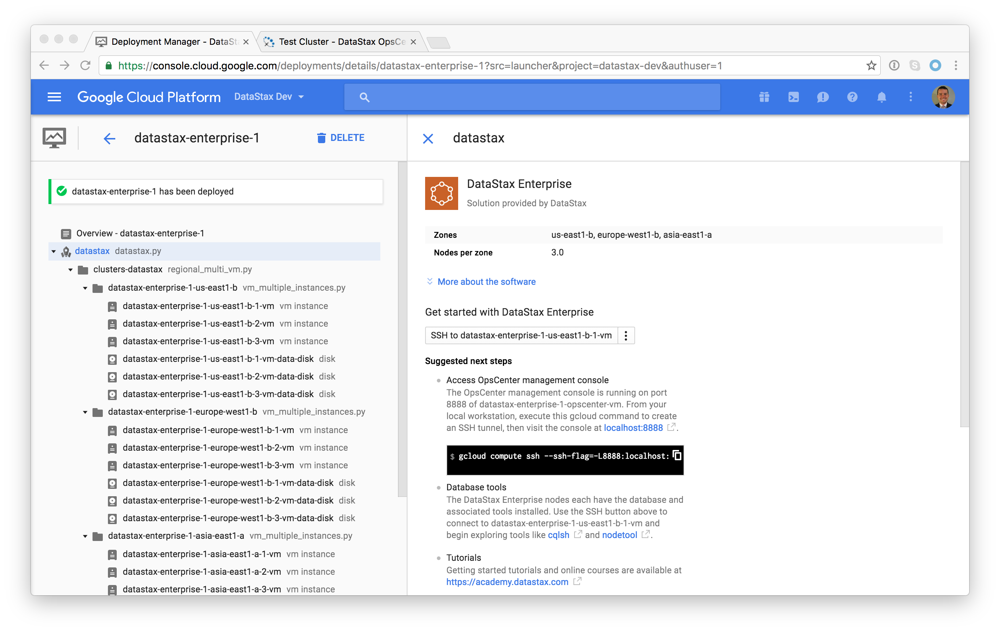
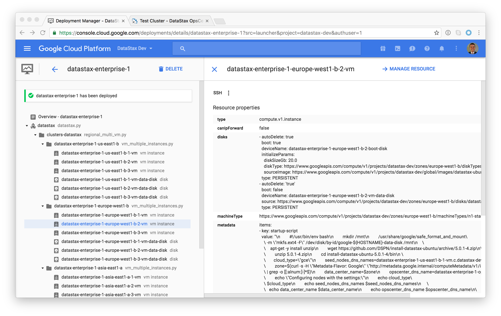
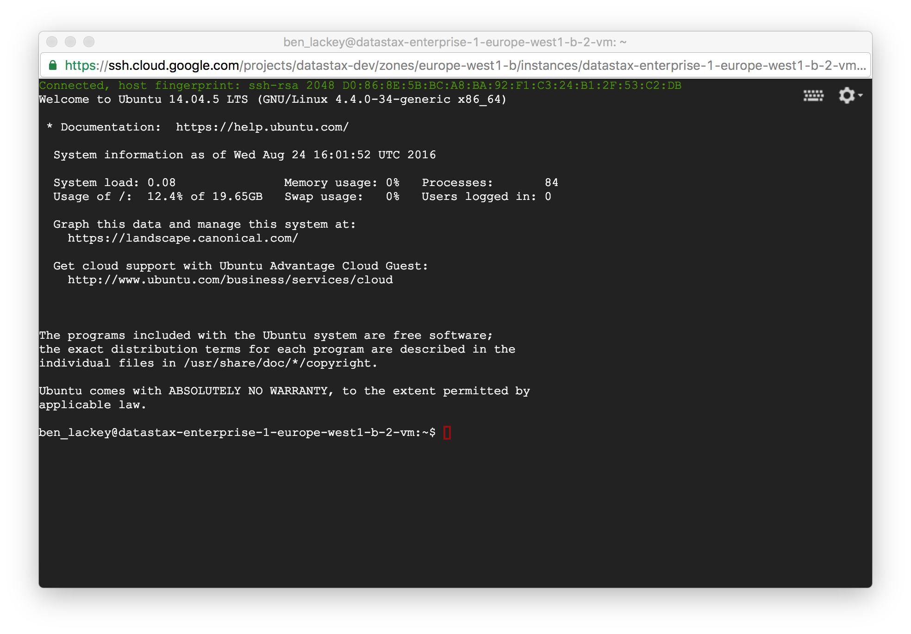

# Google Cloud Launcher

## Deploying
First off we're going to deploy a cluster.  That's really easy with Cloud Launcher.  Simply go to https://console.cloud.google.com/launcher/details/datastax-public/datastax-enterprise

Click "Launch on Compute Engine"

You can take the default settings or customize them.  When complete click "Deploy"

That's it!  You're cluster is now deploying.

## Inspecting the Cluster

The infrastructure will take a few minutes to deploy.  When complete you should see:

To view OpsCenter, the DataStax admin interface, we will need to create an ssh tunnel.  To do that, open a terminal on your local machine and run the command:

    gcloud compute ssh --ssh-flag=-L8888:localhost:8888 --project=<NAME OF YOUR PROJECT> --zone=us-central1-f datastax-enterprise-1-opscenter-vm 

In my case, the project is named datastax-dev, though it will have a different name for you.

Now, we can open a web browser to http://localhost:8888 to view OpsCenter.

Great!  You now have a DataStax Enterprise cluster running with 3 nodes in Asia, Europe and America.

We can also log into a node to interact with the database.  To do that go back to the Google console.

Click on any node.  In DataStax Enterprise the nodes are homogeneous so we can interact with any one.

We can connect to that node by clicking "SSH."  This will open an SSH window.

At this point we can clear the terminal window and start up cqlsh, the command line interface to DataStax Enterprise.

    clear
    cqlsh

From there you can issue any valid cql command.  For instance:

    desc keyspace
    

## Next Steps

If you want to learn more about DataStax Enterprise, the online training courses at https://academy.datastax.com/ are a great place to start.

To learn more about running DataStax Enterprise on GCP take a look at the [best practices guide](bestpractices.md) and [post deploy steps](postdeploy.md).