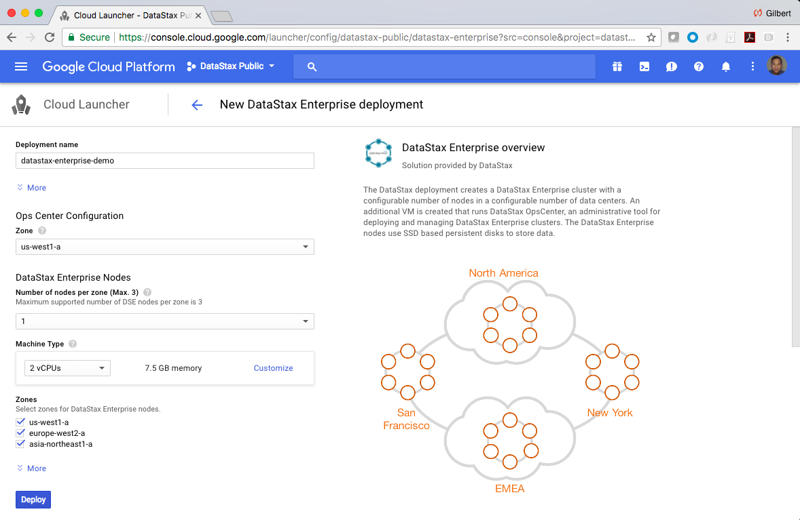
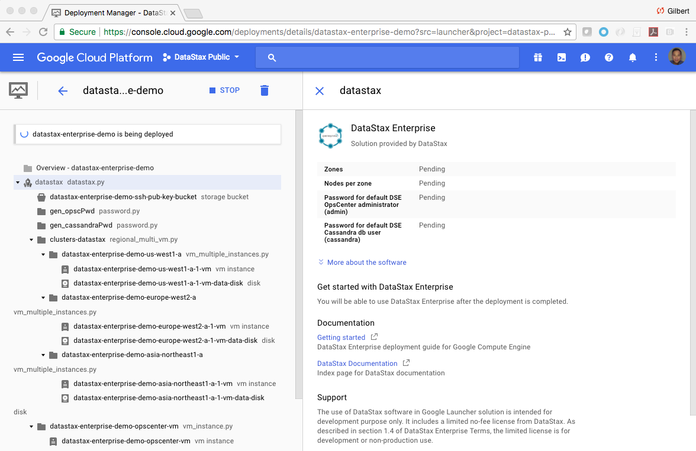
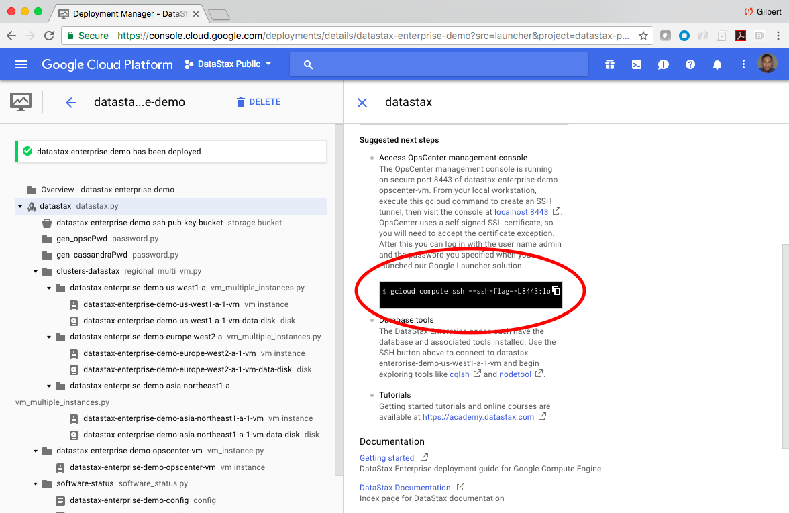
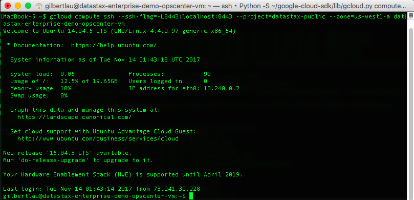
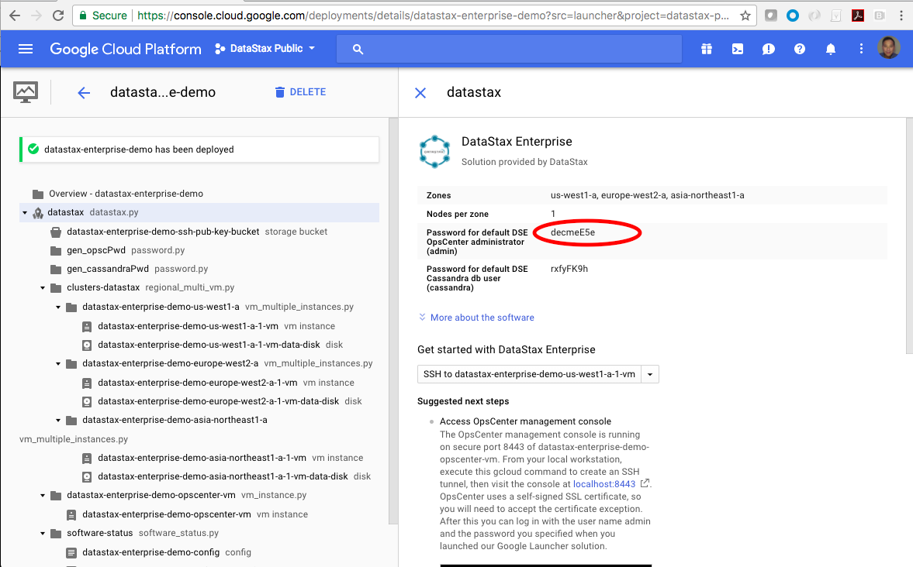
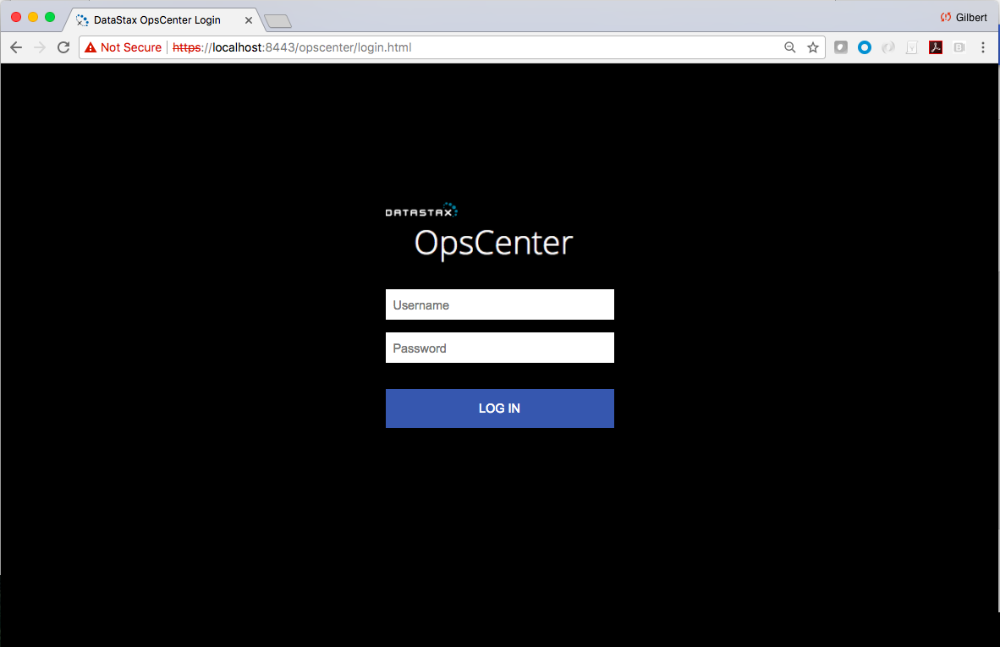
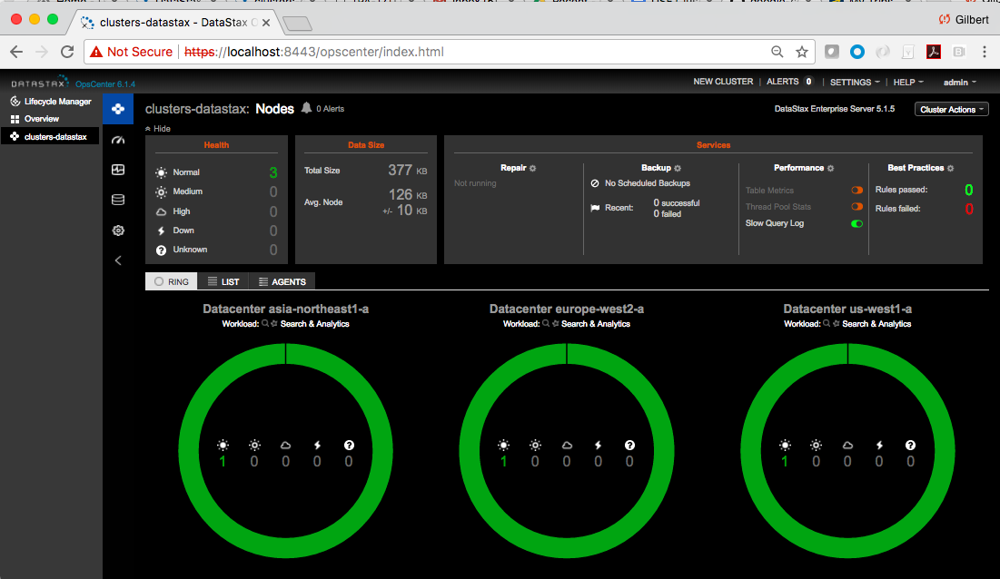
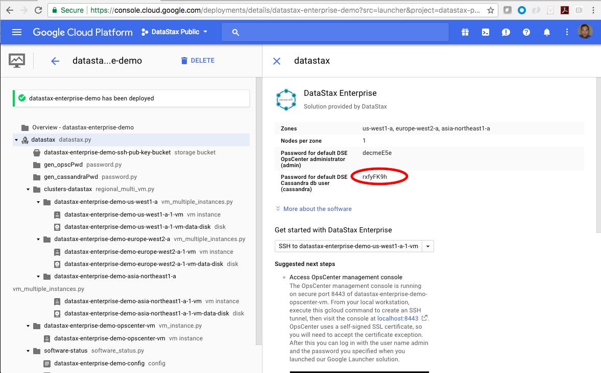

# Google Cloud Launcher

## Deploying
First off we're going to deploy a cluster.  That's really easy with Cloud Launcher.  Simply go to https://console.cloud.google.com/launcher/details/datastax-public/datastax-enterprise

Click "Launch on Compute Engine"

You can take the default settings or customize them.  When complete click "Deploy"

That's it!  Your cluster is now deploying.

## Inspecting the Cluster

When complete you should see:

To view OpsCenter, the DataStax admin interface, we will need to create an ssh tunnel.  To do that, copy & paste the black box inside the red oval to your terminal:

It should look like the following when you run the command:

Now, we can open a web browser to https://localhost:8443 to view OpsCenter.  Before that, grab the OpsCenter "admin" user's password.

Great!  You now have a DataStax Enterprise cluster running with 1 node each in Asia, Europe and America regions.

We can also log into a node to interact with the database.  To do that go back to the Google console and follow the red arrow to start a ssh session using "Open in browser window" option..

Then grab your DSE cluster's "cassandra" user's password as follows:

Connect to your DSE cluster by running the following cqlsh command:

Run a cql command "desc keyspaces" to view the existing keyspaces in your DSE cluster:

## Next Steps

If you want to learn more about DataStax Enterprise, the online training courses at https://academy.datastax.com/ are a great place to start.

To learn more about running DataStax Enterprise on GCP take a look at the [best practices guide](bestpractices.md) and [post deploy steps](postdeploy.md).
