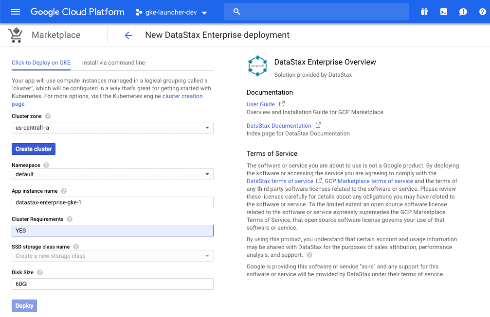
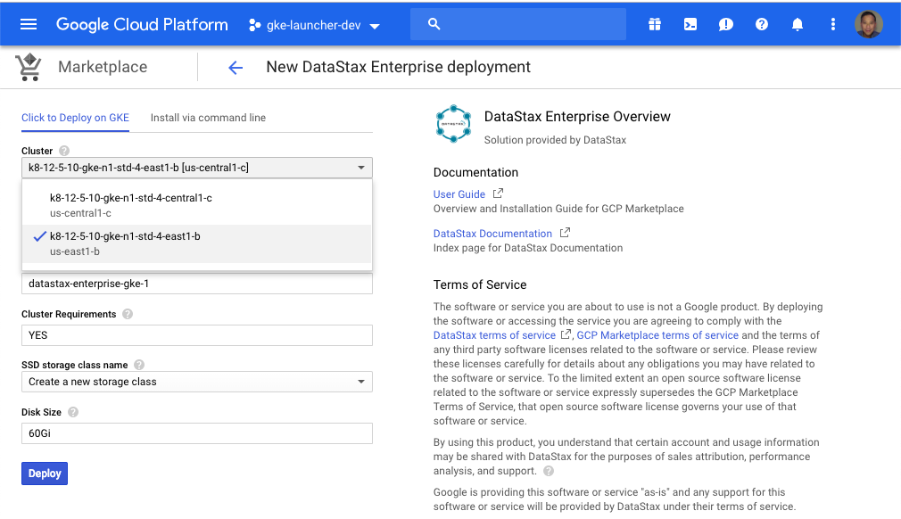
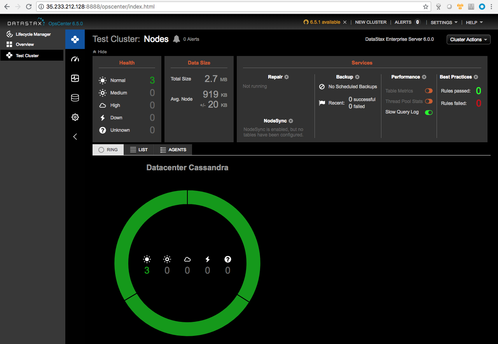

## DataStax Enterprise (DSE) Kubernetes Application User Guide for the GCP Marketplace

This document provides instructions for deploying and decommissioning Datastax Enterprise (DSE) as a Kubernetes app in the GCP Marketplace.

## IMPORTANT NOTE
There are minimum cluster requirements that MUST be met for the deployment to succeed. Please ensure you have a cluster meeting these minimums before deploying. The requirements are >**5 nodes of instance type n1-standard-4 with at least 60GB of disk size for each DSE node**.

When answering **YES** (refer to the screenshot below) to the **Cluster Requirements** field in the Marketplace deployment configuration page, you agree to the minimum GKE cluster requirements (min. 5 n1-standard-4 nodes) to deploy DSE Kubernetes application.


If you do not have a GKE cluster which meets the minimum GKE cluster requirements, you can run the following **gcloud** command to create a GKE cluster.
```
$ gcloud container clusters create <your-GKE-cluster-name> \
  --cluster-version=<your-GKE-cluster-version> \
  --zone <your-GCP-zone> \
  --machine-type n1-standard-4  \
  --num-nodes 5
```
Here is a sample command to find out what GKE cluster versions are available in us-west1-b zone:
```
$ gcloud container get-server-config --zone us-west1-b
```
This is a sample command to create a GKE clsuter with GKE cluster version 1.10.9-gke.5 in us-west1-b zone:
```
$ gcloud container clusters create k8-12-5-10-gke-n1-std-4-east1-b \
  --cluster-version=1.12.5-gke.10 \
  --zone us-east1-b \
  --machine-type n1-standard-4  \
  --num-nodes 5
```
Once your new GKE cluster is created, you can select it from the drop-down listbox (refer to the screenshot below).  In our example, we will choose **k8-12-5-10-gke-n1-std-4-east1-b**.


## Installation
### Quick install with Google Cloud Marketplace
Get up and running with a few clicks! Install this DataStax Enterprise app to a Google Kubernetes Engine cluster using Google Cloud Marketplace. Follow the [on-screen instructions](https://console.cloud.google.com/marketplace/details/datastax-public/datastax-enterprise-gke).

### Verify the status of your DataStax Enterprise deployment
If your deployment is successful, you can check the status of your DataStax Enterprise cluster using the **nodetool status** command as follows:
```
kubectl exec -it "${APP_INSTANCE_NAME}-dse-server-0" --namespace "${NAMESPACE}" nodetool status
```
Sample output as shown below:
```
Datacenter: Cassandra
=====================
Status=Up/Down
|/ State=Normal/Leaving/Joining/Moving
--  Address     Load       Tokens       Owns    Host ID                               Rack
UN  10.16.2.16  924.34 KiB  256          ?       29a8e88d-4dc4-4981-bee6-186c399a2a9d  rack1
UN  10.16.1.35  896.32 KiB  256          ?       f7ac0e87-7cd5-475b-a0a9-e9a0e73e2174  rack1
UN  10.16.0.37  935.8 KiB  256          ?       1c818e6c-c8fd-4f4e-a412-7aff5da18978  rack1
```

### Accessing DataStax Enterprise cloud database via cqlsh
You can run the following commands to access your DataStax Enterprise server via cqlsh as follows:
```
$ kubectl exec -it "${APP_INSTANCE_NAME}-dse-server-0" --namespace "${NAMESPACE}" /bin/bash
$ more /etc/hosts (to find out the IP address of the container)
$ cqlsh <IP-address-of-the-container>
```

### Accessing Opscenter
Find the EXTERNAL-IP of ${APP_INSTANCE_NAME}-dse-server-opsc-ext-lb using "kubectl get service" and point your browser at the URL as follows:
```
SERVICE_IP=$(kubectl get \
  --namespace "${NAMESPACE}" \
  svc "${APP_INSTANCE_NAME}-dse-server-opsc-ext-lb" \
  -o jsonpath='{.status.loadBalancer.ingress[0].ip}')

echo "http://${SERVICE_IP}:8888"
```
You should see the console of DataStax Enterprise OpsCenter like below:



## Scaling the DataStax Enterprise cluster
### Scaling up the DataStax Enterprise cluster
By default, the DataStax Enterprise Kubernetes app is deployed using 3 replicas (equivalent to 3 DSE nodes). To increase the number of replicas (the number of DSE nodes), use the following command:
```
kubectl scale statefulsets "$APP_INSTANCE_NAME-dse-server" \
  --namespace "$NAMESPACE" --replicas=[NEW_REPLICAS]
```
where [NEW_REPLICAS] is the new number.

### Scaling down the DataStax Enterprise cluster
You can manually scale down the DataStax Enterprise cluster using the following procedure.  On each node, you are required to do the following steps starting from the highest-numbered pod of the DSE StatefulSet:
* Inside the DSE container, run $ nodetool decommission.
* Scale down the StatefulSet by one, using the **$ kubectl scale statefulsets** command.
* Wait until the pod is removed from the cluster successfully.
* Remove any persistent volume claim(s) that belong to that replica (DSE node) using the **$ kubectl delete pvc** command.

Repeat this procedure until the DataStax Enterprise cluster has your desired number of pods (DSE nodes).


## Backup and restore
Will be provided in future releases


## Uninstall the DataStax Enterprise Kubernetes Application
### Deleting the DataStax Enterprise Kubernetes app in GCP console
First, you would go to the the DataStax Enterprise Kubernetes **Application details** screen to **DELETE** the application.  See below our sample screen:


### Deleting the persistent values of your deployment
By design, deleting StatefulSets in Kubernetes does not remove PersistentVolumeClaims that were attached to their Pods.  This prevents users from losing their stateful data accidentally.  To remove the PersistentVolumeClaims with their attached persistent disks, you need to run the following commands:
```
export APP_INSTANCE_NAME=<your-app-instance-name>
export NAMESPACE=<namespace-for-your-deployment>

for pv in $(kubectl get pvc --namespace $NAMESPACE \
  --selector app.kubernetes.io/name=$APP_INSTANCE_NAME \
  --output jsonpath='{.items[*].spec.volumeName}');
do
  kubectl delete pv/$pv --namespace $NAMESPACE
done

kubectl delete persistentvolumeclaims \
  --namespace $NAMESPACE \
  --selector app.kubernetes.io/name=$APP_INSTANCE_NAME
```

